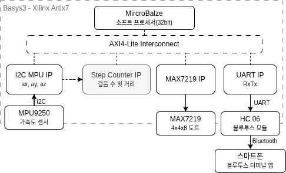

# 건강수호자 (Health Guardian)
 
> MPU9250 가속도 센서와 FPGA SoC 기반 커스텀 IP를 활용한 블루투스 연동 스마트 만보기

<!--

-->

 
---
 
## 1. Overview
 
| 항목 | 내용 |
|------|------|
| 플랫폼 | BASYS3 (Xilinx Artix-7 FPGA) |
| 언어 | Verilog, C |
| 도구 | Vivado HLx, Vitis |
| 통신 | I2C (MPU9250), SPI (MAX7219), UART / Bluetooth (HC-06) |
| 개발 기간 | 2026.05 |
| 팀 구성 | 3인 팀 프로젝트 |
 
---
 
## 2. 주요 기능
 
- **걸음 수 측정**: MPU9250 3축 가속도 합산 모션 레벨 기반 알고리즘으로 걸음 수·거리 실시간 산출
- **실시간 디스플레이**: MAX7219 8×32 도트매트릭스에 현재 걸음 수 즉시 반영
- **블루투스 연동**: HC-06으로 목표 걸음수(1~9999) 입력 → 달성·중단 시 걸음수·거리·시간·속도 결과 전송
- **상태 머신 제어**: `WAIT_GOAL → RUNNING → DONE` 3-state 구조로 전체 흐름 관리
---
 
## 3. 담당 역할
 
**UART 기반 블루투스 통신 및 Vitis 소프트웨어 통합 구현**
 
- **UART IP 설계 참여**: AXI4-Lite 슬레이브 기반 TX/RX 겸용 커스텀 UART IP 설계. `BAUD_DIV` 레지스터로 보드레이트 가변 설정 가능
- **Vitis 소프트웨어 구현**: MPU + STEP 레지스터 폴링 기반 모니터링 초기 버전 작성 후, 상태 머신 기반 최종 통합 로직으로 병합
- **블루투스 통신 로직 구현**: 목표 걸음수 수신 및 결과(걸음수·거리·시간(MM:SS)·속도(km/h)) 포맷 변환 후 HC-06 전송 파이프라인 구축
---
 
## 4. 시스템 아키텍처 및 핵심 구현
 
### Block Diagram
 

 
### 핵심 구현
 
| 구현 | 설명 |
|---|---|
| **① 상태 머신 기반 전체 제어** | `WAIT_GOAL → RUNNING → DONE` 3-state 구조로 흐름 분리. `base_step_count` 오프셋으로 세션별 상대값 계산해 이전 세션 누적값 영향 제거 |
| **② IP 레지스터 직접 접근** | `Xil_In32()` / `Xil_Out32()`로 STEP IP 걸음수·거리 레지스터를 200ms 주기 폴링, `HIGH_TH` · `LOW_TH` 등 임계값을 런타임에 직접 설정해 감도 조정 |
| **③ 블루투스 다자리 수신 (`rxtx_recv_goal`)** | 최대 4자리 버퍼링, `'\r'/'\n'` 종료 처리, idle 500,000회 타임아웃 적용으로 1~9999 범위 목표값 안정적 수신 구현 |
 
---
 
## 5. 트러블슈팅
 
| 발생 문제 | 발생 원인 | 역할 | 해결 방안 | 결과 |
|-----------|-----------|------|-----------|------|
| 블루투스 수신 시 한 자리 숫자만 인식 | 기존 수신 함수가 첫 번째 바이트 수신 즉시 반환하는 구조 | 문제 발견 → 팀원 전달 | 팀원이 `rxtx_recv_goal()` 재설계 (4자리 버퍼링 · `'\r'/'\n'` 종료 · idle 타임아웃 적용), 최종 통합 로직에 병합 | 1~9999 범위 목표 걸음수 정상 수신 |
| 정지 상태에서 걸음 수 오증가 | Z축 단일 입력 시 정지 중 중력 가속도로 인한 오판 | 문제 발견 → 팀원 전달 | 팀원이 X·Y·Z 3축 합산 모션 레벨 기반으로 STEP IP 재설계, `HIGH_TH` · `LOW_TH` 등 파라미터 추가 | 정지 시 걸음 수 오증가 해소, 감도 조정 가능 |
 
---
 
## 6. 디렉토리 구조
 
| 경로 | 내용 |
|------|------|
| `SoC/ip_repo/dotmatrix_ip_1_0/` | MAX7219 도트매트릭스 IP (Verilog) |
| `SoC/ip_repo/i2c_mpu_ip_1_0/` | I2C MPU9250 IP (Verilog) |
| `SoC/ip_repo/myip_rxtx_1_0/` | 커스텀 UART TX/RX IP (Verilog) |
| `SoC/ip_repo/step_counter_ip_1_0/` | 걸음 수 카운터 IP (Verilog) |
| `SoC/project_all/` | Vivado 프로젝트 (Block Design · 합성·구현 결과 · `.xsa` · `.xpr`) |
| `Vitis/platform_Project_MPU_Counter/` | Vitis 플랫폼 (BSP · `xparameters.h`) |
| `Vitis/Project_MPU_Counter/src/helloworld.c` | 메인 소프트웨어 (상태 머신 · BT 통신) |
| `SoC Project IP Register Description.docx` | IP 레지스터 데이터시트 |
